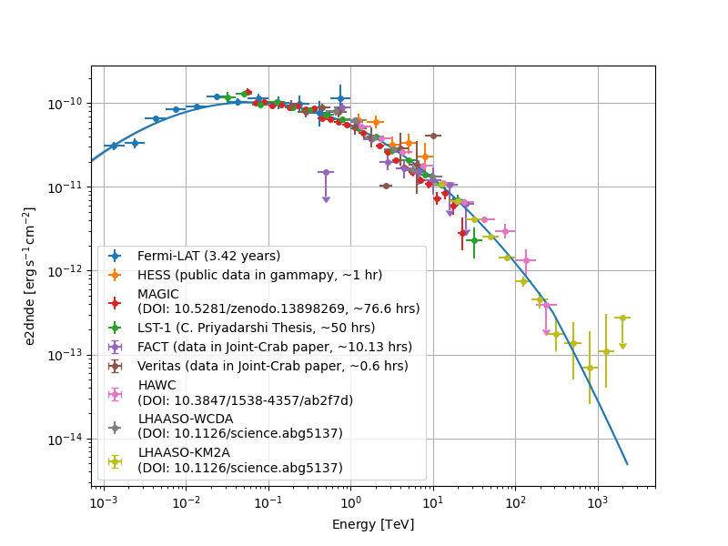

Multi-instrument analysis of Crab Nebula
========================================

Here is the more extensive example of a multi-instrument joint-fit analyses of the Crab Nebula.
Only publicly available data are used to show this example, and the contribution of the Crab Pulsar has not been removed from the data.

Description of the datasets
---------------------------

#. Fermi-LAT - **3D DL3** Dataset for the period of 3 years 5 months, generated by `Lea Heckmann <https://orcid.org/0000-0002-6653-8407>`_

#. H.E.S.S. - **3D DL3** Dataset available in ``gammapy-datasets`` with livetime of ~1 hr

#. MAGIC - **1D DL3** Dataset available at `DOI: 10.5281/zenodo.13898269 <https://doi.org/10.5281/zenodo.13898269>`_ with a total livetime period of ~76.61 hrs. This includes all the data available there, which includes data taken in ``moon`` condition with different NSB levels, and in ``dark`` condition with multiple offsets.

#. CTAO-LST1 - **1D DL3** Dataset used in C. Priyadarshi's `thesis <https://www.tdx.cat/handle/10803/691736#page=1>`_ with a period of ~50 hrs (11/2020 - 03/2022), which includes data taken with zenith up to 52.5 deg

#. FACT - **1D DL4** Dataset available in ``gammapy-datasets`` and used in `DOI: 10.1051/0004-6361/201834938 <https://doi.org/10.1051/0004-6361/201834938>`_ with livetime of ~10.13 hrs

#. VERITAS - **1D DL4** Dataset available in ``gammapy-datasets`` and used in `DOI: 10.1051/0004-6361/201834938 <https://doi.org/10.1051/0004-6361/201834938>`_ with livetime of ~0.60 hrs

#. HAWC - Flux Points (**DL5**) dataset available in ``gammapy-datasets`` as taken from `DOI: 10.3847/1538-4357/ab2f7d <https://doi.org/10.3847/1538-4357/ab2f7d>`_

#. LHAASO (WCDA and KM2A) - Flux Points (**DL5**) dataset as taken from `DOI: 10.1126/science.abg5137 <https://doi.org/10.1126/science.abg5137>`_

The peak energy of the Log Parabola model here is 61.448 +/- 2.718 GeV
