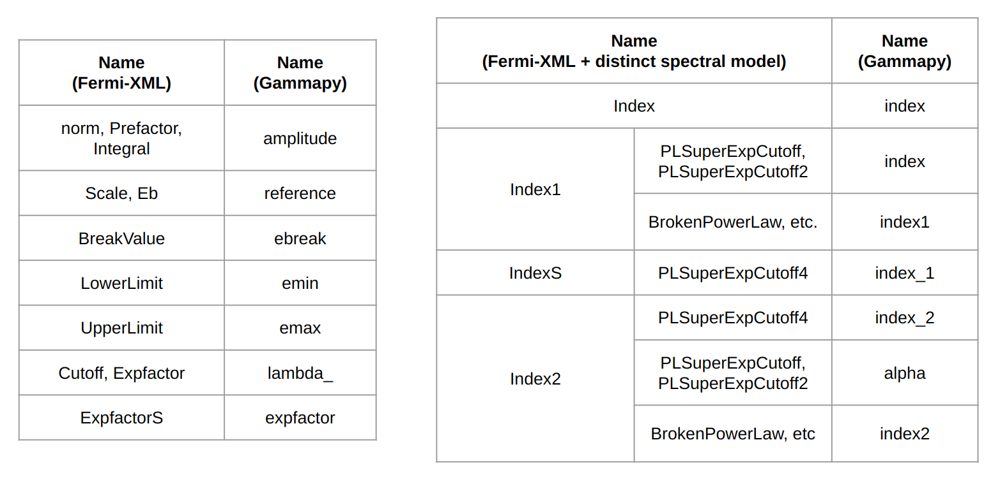

asgardpy.data.target module
===========================

.. automodule:: asgardpy.data.target
   :members: set_models, config_to_dict, create_source_skymodel, params_renaming_to_gammapy, params_rescale_to_gammapy, xml_spectral_model_to_gammapy_params, xml_spatial_model_to_gammapy, create_gal_diffuse_skymodel, create_iso_diffuse_skymodel
   :undoc-members:
   :show-inheritance:

Spectral model parameter renaming to Gammapy default
====================================================

