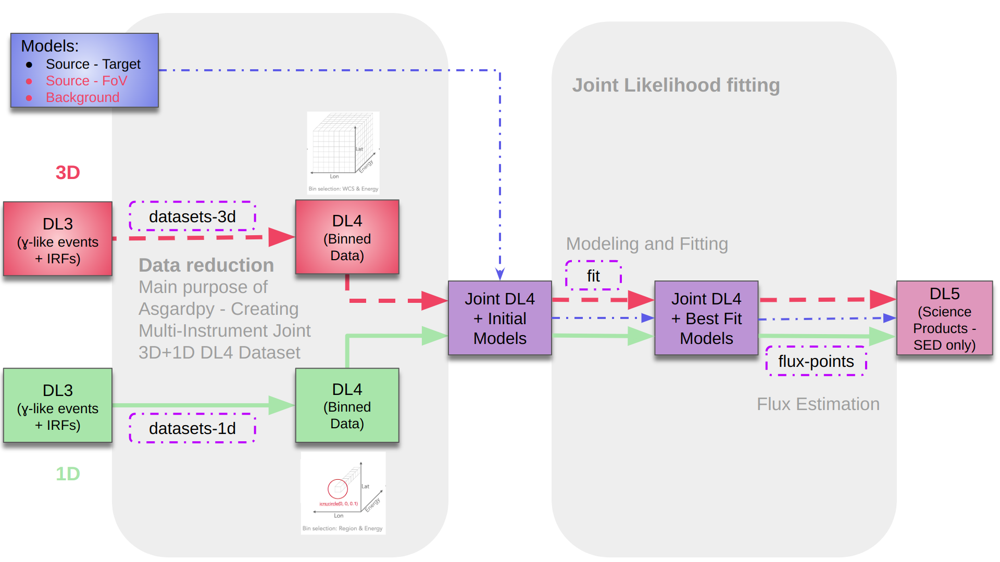

Overview of asgardpy
====================

Main structure
--------------

The package is structured in 2 ways -

#. Creating the AnalysisConfig based on several Config components - :class:`~asgardpy.config`

#. Generating AsgardpyAnalysis based on several Analysis Step components - :class:`~asgardpy.analysis`

Analysis Steps
--------------

The configuration-based pipeline separates the Gammapy-based High-Level Analysis into serialized intermediate steps.
Check :class:`~asgardpy.analysis.analysis_step_base` for more details.
The steps are:

#. datasets-3d :class:`~asgardpy.data.dataset_3d.Datasets3DAnalysisStep`

#. datasets-1d :class:`~asgardpy.data.dataset_1d.Datasets1DAnalysisStep`

#. fit :class:`~asgardpy.data.dl4.FitAnalysisStep`

#. flux-points :class:`~asgardpy.data.dl4.FluxPointsAnalysisStep`

The main purpose of this pipeline is accomplished for -

#. Reducing DL3 data from multiple gamma-ray astronomical instruments to a joint DL4 dataset.

#. update the joint DL4 data with appropriate Gammapy Models object.

#. perform DL4 to DL5 (SED only) after performing joint-likelihood fitting.

.. _dataset-intro:

DL3 Data component
------------------

The "DL3 level" data files for any instrument is read by providing the path location and a search glob pattern in the Config file. These are read
by the :class:`~asgardpy.io.io.DL3Files`.

The main modules dealing with the 2 types of data being read are -

#. 3D Dataset :class:`~asgardpy.data.data_3d`

#. 1D Dataset :class:`~asgardpy.data.data_1d`

They each build their Config components using classes defined with,

#. a base in :class:`~asgardpy.base.base`,

#. from distinct modules -

   #. Base Geometry :class:`~asgardpy.base.geom`

   #. Dataset Reduction :class:`~asgardpy.base.reduction`

#. and from their own respective modules

The processing of Dataset creation is performed by :class:`~asgardpy.data.dataset_3d.Dataset3DGeneration` and :class:`~asgardpy.data.dataset_1d.Dataset1DGeneration`

For the DL3 files with energy-dependent directional (RAD_MAX) cuts, the ON region is defined by a ``PointSkyRegion`` whereas for files with global cuts, the ON region is defined by a ``CircleSkyRegion``.
The usage of either of these can be generalized by providing the source sky position with a value of radius as 0 deg (by default) or a non-zero angular radius, respectively.

Following `Gammapy v1.2 <https://docs.gammapy.org/1.2/>`_ we have the usage of parallel processing for DL4 Dataset creation, Flux Points Estimation among others.
For the first two processes, here we have the parameters of ``n_jobs`` and ``parallel_backend`` defined in :class:`~asgardpy.config.generator.GeneralConfig` as can be seen in :class:`~asgardpy.config.generator.AsgardpyConfig`.

.. _models-intro:

Models
------

The :doc:`_api_docs/data/target/data_target_b` contains various classes for various Models objects and :doc:`_api_docs/data/target/data_target_f` contains various functions for handling them.

The information regarding the model to be used for the target source is given by :class:`~asgardpy.data.target.Target` and the various input options are -

#. Include the model information in :class:`~asgardpy.data.target.Target.components`

#. Include the path for a separate model file in :class:`~asgardpy.data.target.Target.models_file`

#. Use :class:`~asgardpy.data.target.Target.from_3d` ``= True``, if the model is included in the list of Models provided with the 3D Dataset

While combining DL4 datasets from multiple instruments, the positions of the target source, included within these data, may not be exactly the same.
This will cause computation issue for the binned analysis performed with Gammapy. To resolve this issue, use :class:`~asgardpy.data.target.Target.use_uniform_position` ``= True``.

The :class:`~asgardpy.data.target.apply_selection_mask_to_models` function is used to apply various selections on the given list of models.

High-level Analysis
-------------------

The various Config components and Analysis steps for the high-level analysis can be found in :class:`~asgardpy.data.dl4`.

For the analysis step of flux-points :class:`~asgardpy.data.dl4.FluxPointsAnalysisStep`, the flux points are estimated for each instrument dataset, using the respective energy ranges
provided in the respective config section of ``spectral_energy_range``.

For deriving the correct EBL-deabsorbed spectrum, one can use :class:`~asgardpy.analysis.analysis.get_correct_intrinsic_model` and
:class:`~asgardpy.analysis.analysis.get_correct_ebl_deabs_flux_points` after running the flux-points analysis step.

.. _stats-intro:

Statistics
----------

The :class:`~asgardpy.stats` contains various functions to perform some statistics with the fitted DL4 datasets.
One can perform tests on the preference of the assumed spectral model of the target source, by using either :class:`~asgardpy.stats.stats.check_model_preference_lrt` or :class:`~asgardpy.stats.stats.check_model_preference_aic`.
